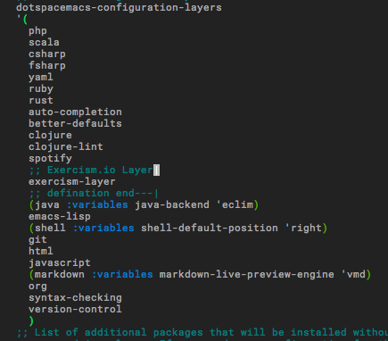
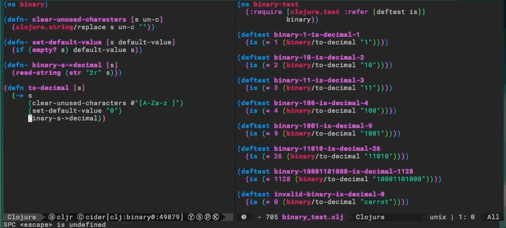
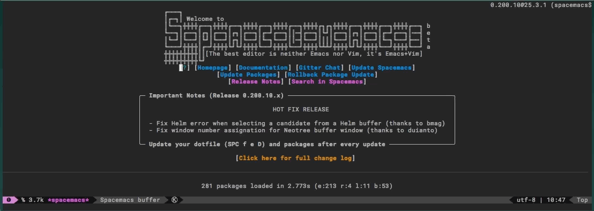

# exercism-layer
A Spacemacs layer for handling Exercism.io local commands.

## Installation

Add `exercism-layer` in to your layers at dotspacemacs file.

> `SPACE fed`  command simply open it.

Run `git clone https://github.com/LeaveNhA/exercism-layer ~/.emacs.d/layers/` command or you can download this repository manually and drop it under .emacs.d/layers file.

## Usage
After installation. The keybinds are loaded automatically.

### Fetch-ing new exercise from Exercism.io

> Press; `SPC Exf`. Exercism-layer Fetch another problem for you in same language you are working on.

### Fetch-ing new exercise for another language

> Press; `SPC Exf` while you're not in a specific language file or dedicated buffer for it.

### Sending your solution file to Exercism.io

> Press; `SPC Exs`.

## TODO
* implement other features.
